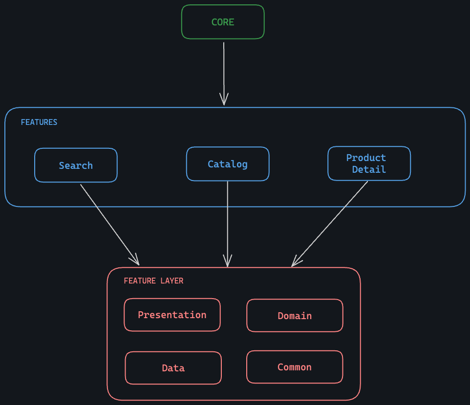

# Mercado Libre - Android native challenge

## Descripción

Este proyecto es una aplicación nativa en android, con Kotlin, JetpackCompose y Clean Architecture.
El objetivo principal es buscar productos en el catalogo de Mercado Libre, por medio de las APIS expuestas a la comunidad.

## Estructura

## Librerías Utilizadas

Algunas librerías usadas en este proyecto:

| Librería | Descripción               | Documentación                                                  |
| -------- | ------------------------- | -------------------------------------------------------------- |
| Koin     | Inyección de dependencias | https://insert-koin.io/docs/quickstart/android/                |
| Retrofit | Cliente HTTP              | https://square.github.io/retrofit/                             |
| Moshi    | Serializador JSON         | https://github.com/square/moshihttps://github.com/square/moshi |
| Coil     | Cargador de imágenes      | https://coil-kt.github.io/coil/                                |
| Timber   | Android Logger            | https://github.com/JakeWharton/timber                          |

## Características Principales

1. **Búsqueda**: Buscar en catalogo de productos.
2. **Catalogo**:  Listar catalogo de productos.
3. **Detalle de Producto**:  Mostrar detalle de un producto.

## Ejecución

1. Clonar este repositorio.
2. Abrir con Android Studio.
3. Sincronizar dependencias (Gradle).
4. Ejecutar app (Emulador/Dispositivo real).
